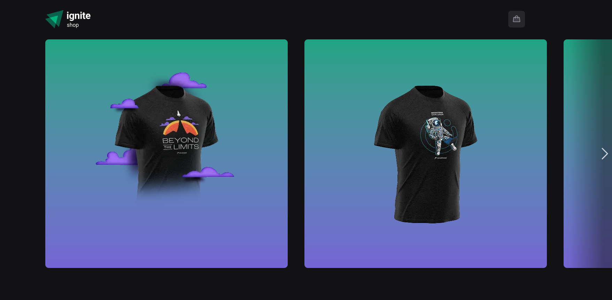

# 🛍️ Ignite Shop V2

Uma aplicação moderna de e-commerce desenvolvida com Next.js 14 (App Router), TypeScript e Tailwind CSS. Integrada ao Stripe para gerenciamento de produtos e pagamentos, oferece uma experiência de compra fluida e responsiva.

## 🌐 Deploy

[Confira a versão em produção](https://ignite-shop-v2-eight.vercel.app/)

## ✨ Funcionalidades

✅ Listagem de produtos com dados dinâmicos do Stripe

✅ Página de detalhes do produto com informações completas

✅ Carrinho de compras com gerenciamento de itens

✅ Checkout integrado ao Stripe

✅ Página de sucesso personalizada após a compra

✅ Animações suaves com Tailwind CSS

✅ Skeletons de carregamento para melhor UX

✅ Responsividade total para dispositivos móveis

## 📸 Capturas de Tela

## 🛠️ Tecnologias Utilizadas

- Next.js 14 (App Router)
- TypeScript
- Tailwind CSS
- Stripe API
- Radix UI
- shadcn/ui
- Axios
- Phosphor Icons
- Embla Carousel

## 📦 Como Começar

Siga os passos abaixo para rodar o projeto localmente:

1. Clone o repositório: `git clone https://github.com/Valdiberto/ignite-shop-v2.git`

2. Navegue até a pasta do projeto: `cd ignite-shop-v2`

3. Instale as dependências: `npm install`
   ou
   `yarn install`

4. Configure as variáveis de ambiente:

5. Crie um arquivo .env.local na raiz do projeto com as seguintes variáveis:

env

`NEXT_PUBLIC_STRIPE_PUBLIC_KEY=suachavepublica`

`STRIPE_SECRET_KEY=suachavesecreta`

`NEXT_URL=http://localhost:3000`

🔐 As chaves do Stripe podem ser obtidas em dashboard.stripe.com

6. Inicie o servidor de desenvolvimento:
   `npm run dev`
   ou
   `yarn dev`

Acesse http://localhost:3000 no seu navegador.

## 🧪 Testes

Atualmente, o projeto não possui testes automatizados. Contribuições são bem-vindas!

## 📤 Deploy

Recomendado com Vercel:

Conecte seu repositório GitHub

Configure as variáveis de ambiente

Deploy automático a cada push

## 📄 Licença

Este projeto está licenciado sob a Licença MIT.

## 🙋 Autor

Feito com ❤️ por Valdiberto Mendes
